# hcs-android

安卓基础代码，所有设备的代码都从此衍生出去
*视频播放、呼叫相关的库都只编译了arm系统，x86平台并不支持，所以无法在虚拟机上调试相关功能，只能在arm平台（比如真机）上进行调试。
*gradle.properties 涉及账号、密码登隐私配置，不便上传到代码仓库，需要自行生成（可参考gradle-sample.properties）

# Android Studio版本

Android Studio Dolphin | 2021.3.1
Build #AI-213.7172.25.2113.9014738, built on September 1, 2022
Runtime version: 11.0.13+0-b1751.21-8125866 x86_64
VM: OpenJDK 64-Bit Server VM by JetBrains s.r.o.
macOS 12.6.8
GC: G1 Young Generation, G1 Old Generation
Memory: 1024M
Cores: 8
Registry:
external.system.auto.import.disabled=true
ide.text.editor.with.preview.show.floating.toolbar=false

Non-Bundled Plugins:
idea.plugin.protoeditor (213.6461.28)
org.intellij.plugins.markdown (213.6777.22)
com.thoughtworks.gauge (213.5744.125)

## 目录结构
~~~
hcs-android     
├── app                         // 业务库测试app
│    └── adapter                // 适配器，主要针对RecyclerView、ListView  
│    └── config		            // 常用配置
│    └── factory	            // 工厂类，MVVM模式的组成部分，方便根据不同类型产生对应的实例
│    └── fragment	            // 碎片类，具体页面都尽量用fragment实现
│    └── provider	            // 方便灵活提供fragment的
│    └── viewmodel	            // MVVM的后面VM部分
│    └── assets	                // 静态文件存放路径
│          └── web              // WEB管理页面的前端路径
│    └── websrc	                // WEB管理页面的前端源码-ruoyi-vue框架
├── lib-hcs-android-common      // 基础代码的统一封装
│          └── cpp	            // native层代码
│          └── hardware	        // 硬件相关代码
│          └── multicast	    // 组播收发相关代码
│          └── network	        // 网卡设置相关代码
│          └── record	        // 音视频录制相关代码
│          └── settings	        // 设置封装
│          └── updateservice	// 升级服务
│          └── util	            // 工具类库
│          └── watchdog	        // 看门狗
│          └── BaseApplication	// 初始化应用程序，app的入口程序一定要继承自它，因为ARouter、KLog等都需要第一时间被初始化
├── lib-hcs-android-ui          // 界面相关的统一封装，主要是针对MVVM的封装，还有一些常用的view
│    └── common		            // 显示操作（MVVM）的统一封装
│          └── adapter          // 适配器的统一封装
│          └── binding          // 对界面生命期各个阶段回调的统一封装
│          └── event            // 事件回调的统一封装
│          └── manager          // activity的统一管理器，在处理界面的前进、回退效果时比较有帮助
│          └── mvvm             // MVVM模式的统一封装
│          └── networks         // 网络处理的相关封装、此处主要处理有线网络、静态地址等设定吧，毕竟移动设备很少涉及到这方面
│          └── provider         // 方便统一调度的，其功能性还未开发出来
│          └── view	            // 一些常用视图
│          └── util	            // 界面显示相关的一些工具类库
├── lib-hcs-android-client      // 方便app以client模式统一调用外部接口
│          └── config		    // 常用配置
│          └── dto		        // 数据回复的最外层DTO，具体为 {"code":"返回代码","msg":"信息","data":{数据对象}} 
│                                 或  {"code":"返回代码","msg":"信息","data":[数据列表]}
│          └── http		        // http请求的封装
│          └── util	            // 工具类库
│          └── CommonService    // 登录、授权获取等基本操作在此处理
│          └── RetrofitManager  // 网络请求的统一管理器
├── lib-hcs-android-server      // app作为服务端相关的封装，主要是提供web服务、Restfull接口
│          └── config		    // 常用配置
│          └── controller       // MVC架构的C模块
│          └── dao              // 数据库访问模块，此处主要是用room对sqlite进行访问控制
│          └── entity           // 实体类
│          └── Interceptor      // 拦截器，主要用于授权拦截和统一编写访问日志
│          └── service          // MVC架构的M部分
│          └── util	            // 服务端专用工具类库
│          └── web              // WEB服务模块的基础封装
│          └── AppConfig        // 增加静态目录
├── lib-hcs-android-call        // app作为呼叫相关的封装，主要是提供对linphone的二次封装，方便上层调用
│          └── api		        // 简化后方便上层调用的接口，几个helper可以提供傻瓜式的操作
│          └── fragment		    // 有关通话时视频显示的界面封装
│          └── receivers        // 消息接收器
│          └── util	            // 呼叫模块专用工具类库
│          └── view	            // 视频显示相关的视图封装
│          └── LinphoneService	// linphone的后台服务，由PhoneManager调用
├── demo-call                   // 呼叫库测试app
│    └── adapter                // 适配器，主要针对RecyclerView、ListView  
│    └── config		            // 常用配置
│    └── factory	            // 工厂类，MVVM模式的组成部分，方便根据不同类型产生对应的实例
│    └── fragment	            // 碎片类，具体页面都尽量用fragment实现
│    └── provider	            // 方便灵活提供fragment的
│    └── viewmodel	            // MVVM的后面VM部分
├── demo-common                 // 通用库测试app
│    └── adapter                // 适配器，主要针对RecyclerView、ListView  
│    └── config		            // 常用配置
│    └── factory	            // 工厂类，MVVM模式的组成部分，方便根据不同类型产生对应的实例
│    └── fragment	            // 碎片类，具体页面都尽量用fragment实现
│    └── provider	            // 方便灵活提供fragment的
│    └── viewmodel	            // MVVM的后面VM部分
├── lib-hcs-android-annotation  // 自定义注解，当前只为业务层的交互信息提供了注解
│          └── annotation		// 自定义注解
│          └── api		        // 主要看HandlerManager，由它对自动生成的文件进行统一调用
├── lib-hcs-android-processor   // 自定义注解处理器
│          └── constant		    // 常量定义
│          └── util		        // 注解处理器专业工具类库
│          └── CommandProcessor // 针对业务层的交互命令提供的主机处理器
│          └── resources		// 告诉javax哪些注解处理器需要处理
├── lib-hcs-android-business    // 对业务层的统一封装，后续各个app只要调用此模块即可
│          └── constant		    // 常量定义
│          └── controller		// 控制器（web端、UI端使用相同的控制器）
│          └── dao		        // 数据库访问
│          └── entity		    // 实体类
│          └── manager		    // 设备、工作管理器
│          └── request		    // 这个命名不是特别合适，主要是给UI请求business层业务，
                                // 或者business访问服务器的相关封装
│                 └── model     // 网络请求的二次封装
│                 └── service   // 网络请求接口
│                 └── viewmodel // 提供给ui层的通用viewmodel
│          └── service		    // 对数据库访问结合业务的二次封装（等同spring mvc模式下的service）
├── signapk                     // 用于将apk认证成系统模块的证书
├── drivers                     // 底层驱动，放入android系统源码的kernel/drivers/serial目录下
~~~
## 整体结构思维导图
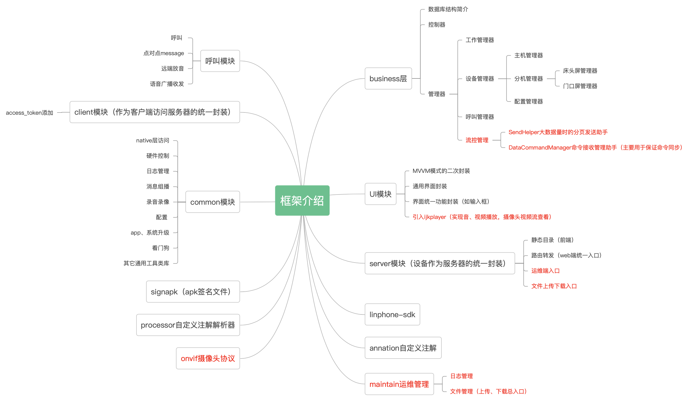

## lib-hcs-android-common调用
* 引入私有仓库
~~~
dependencyResolutionManagement {
    repositoriesMode.set(RepositoriesMode.FAIL_ON_PROJECT_REPOS)
    repositories {
        //++++ 其它类库需要的仓库地址 start
        google()
        mavenCentral()
        maven { url 'https://jitpack.io' }
        //+++ 其它类库需要的仓库地址 end
        //++++ 私有仓库地址 start
        maven {
            url 'https://maven.pkg.github.com/'
            allowInsecureProtocol = true
        }
        //++++ 私有仓库地址 start
    }
}
~~~

* 添加类库引用
~~~
    implementation('io.github.netwolf712:lib-hcs-android-common:0.1.0'){
        //将内建库变为动态更新版本，便于实时同步
        changing = true
    }
~~~

* 添加类库每次编译时重新刷新功能（因为私有类库正在开发阶段会持续更新）
~~~
configurations.all {
    // Check for updates every build
    resolutionStrategy.cacheChangingModulesFor 0, 'seconds'
}
~~~
## lib-hcs-android-common 提交到私有仓库
* 编译类库 
  选中lib-hcs-android-common项目，在菜单Build->Make selected Modules或Make Module 'lib-hcs-android-common'，保证模块编译通过
* 提交类库到github仓库 
  点击编辑器右侧Gradle，在弹出的列表中选择hcs-android->lib-hcs-android-common-Run Configurations->upload，双机即可提交

## web管理页面

- lib-hcs-android-server提供了基础的web服务
- lib-hcs-android-maintain扩展了web功能，除了提供可供第三方直接调用的类库之外，也提供了restful形式的接口调用模式，提供了额外的前端分离页面 https://github.com/netwolf712/hcs-web-maintain
- lib-hcs-android-business扩展了web功能，除了提供可供第三方直接调用的类库之外，也提供了restful形式的接口调用模式，前端分离页面 https://github.com/netwolf712/hcs-web-nurse-master
- 将前端分离页面通过npm install build:prod编译成发布包后，再把发布包放入app的src/main/assets目录，即可实现管理页面与app的一体化部署
  （访问app所在设备的ip的80端口，就是管理页面。）
- 其中账号/密码: Admin/Admin
- 示例图片
<table>
    <tr>
        <td>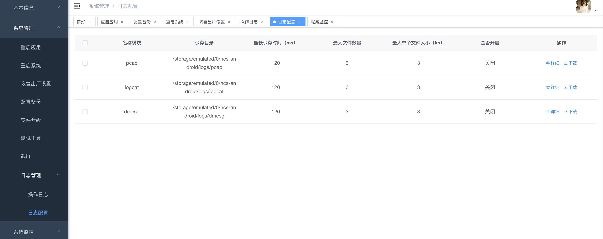</td>
        <td>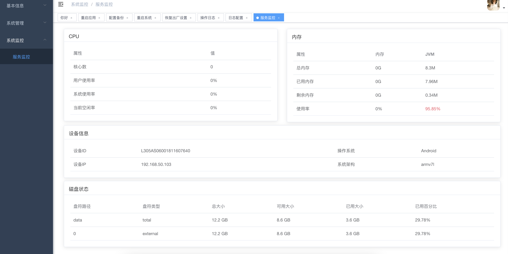</td>
    </tr>
    <tr>
        <td>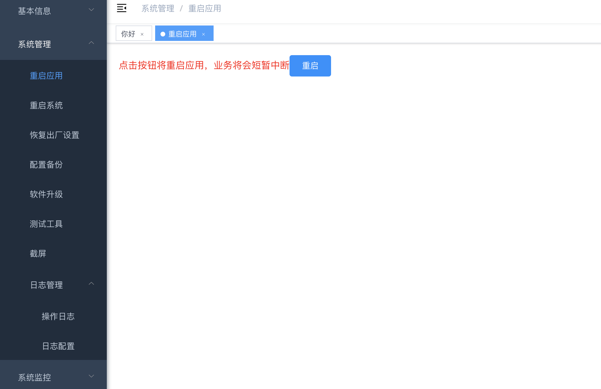</td>
        <td>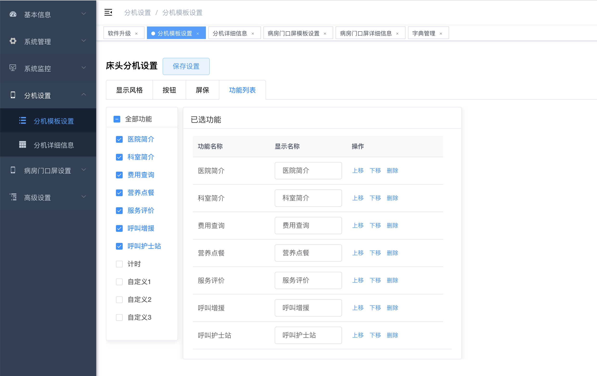</td>
    </tr>    
    <tr>
        <td>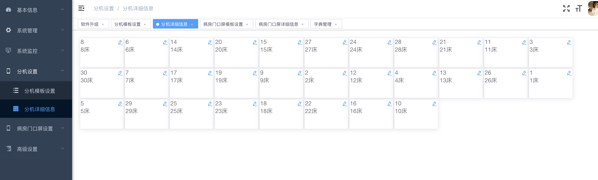</td>
        <td>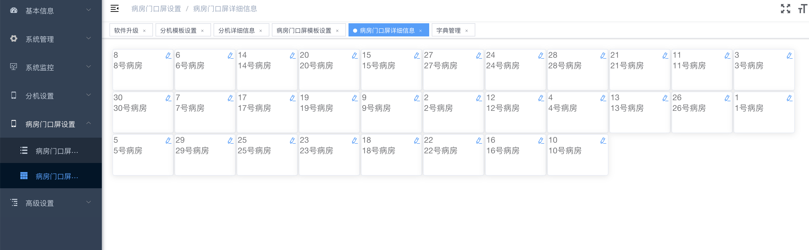</td>
    </tr>
    <tr>
        <td>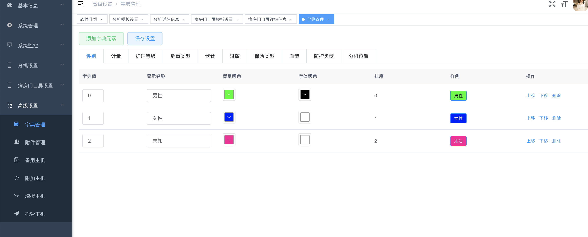</td>
        <td>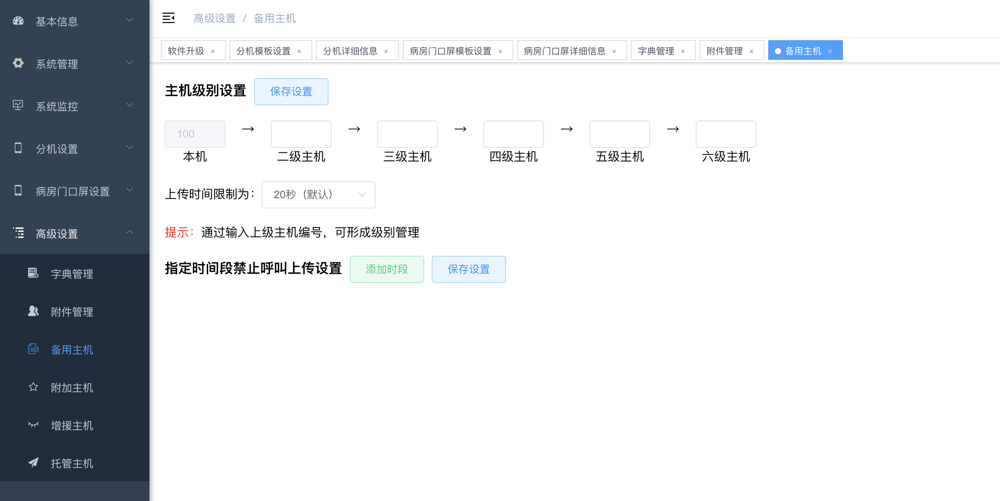</td>
    </tr>
    <tr>
        <td>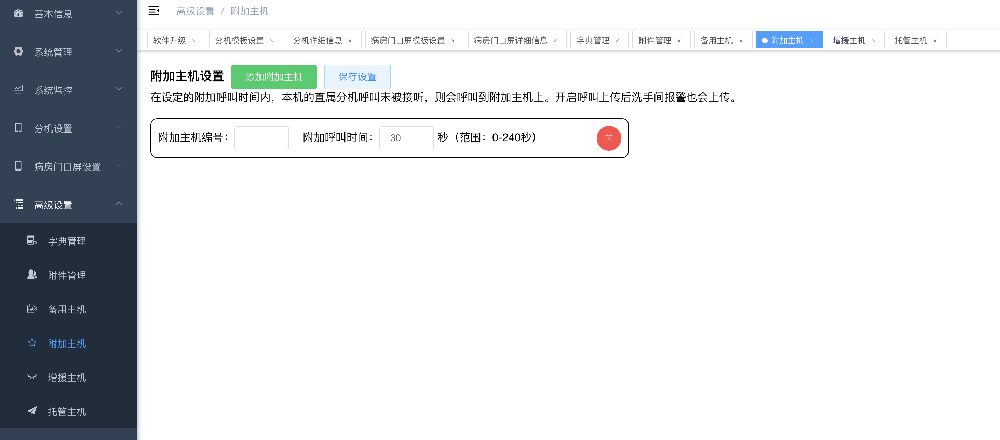</td>
        <td>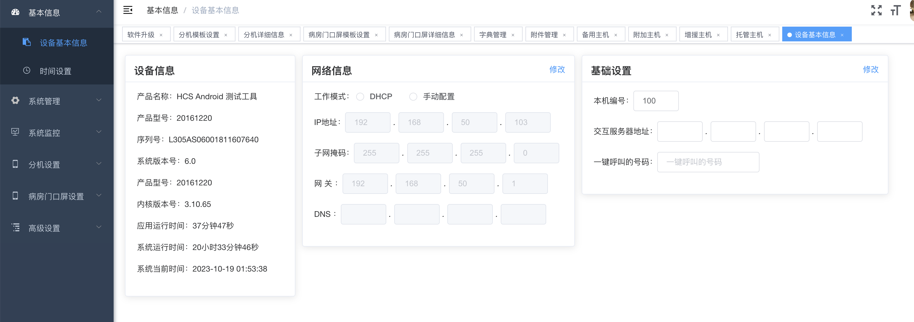</td>
    </tr>
</table>